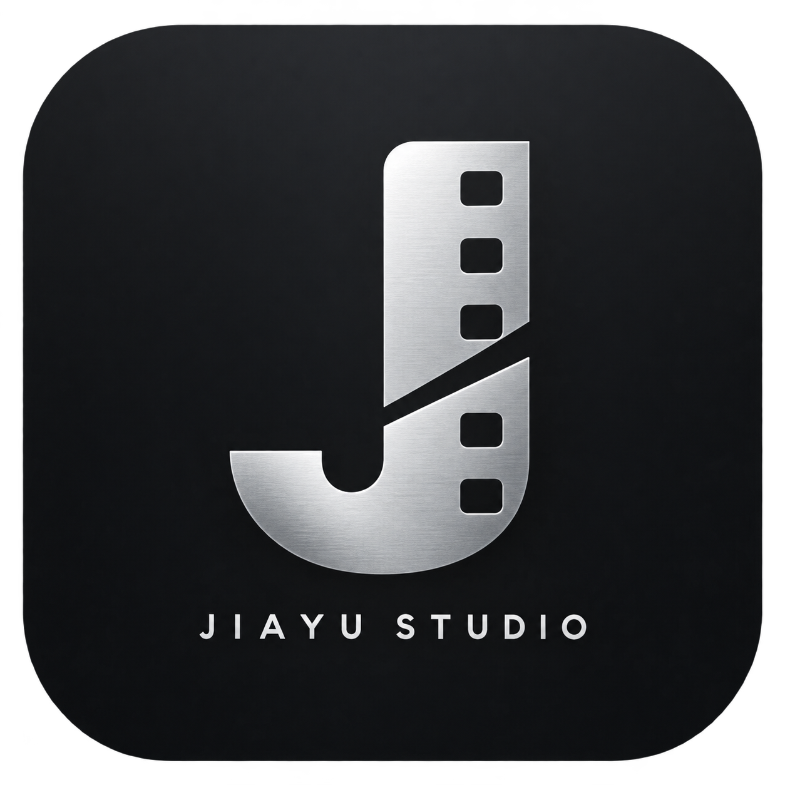

# JIAYU VideoSplit · 视频快拆 1.0.1

<p align="center"></p>

原生 macOS 视频拆分工具。一个视频，自定义第一段时长，直接拆成两份。全程复制压缩数据，不转码、不渲染，原文件不变。

## 下载与安装

在 [Releases](https://github.com/NobitaChow/JIAYU-VideoSplit/releases/latest) 下载 DMG，拖入「应用程序」。支持 Apple Silicon（M 系列）和 macOS 14+。应用名包含版本号，更新前请退出旧版。

发行包内置 FFmpeg。采用 ad-hoc 签名，尚无 Developer ID 签名或 Apple 公证。

## 使用

1. 拖入一个视频到窗口，或点击「选择视频」。
2. 输入第一段时长，例如 `00:10:00` 或 `600`；载入后默认填入总时长的一半。
3. 点击「拆成两份」。默认在原视频所在目录创建独立文件夹，内含第1段、第2段。

支持 MP4、MOV、MKV、WebM、M4V、TS。免转码切点顺延到下一个关键帧，实际第一段可能略长，无法保证逐帧精确；切点之后没有关键帧时会提示提前时间。

保留原容器可重新封装的音轨和字幕；遇不兼容轨道会报错。章节不保留。原目录需可写，并有约原视频大小的剩余空间。处理期间请等待完成后退出。

## 构建

在 Apple Silicon Mac 安装 Xcode Command Line Tools、Python 3 和 Homebrew FFmpeg，然后运行：

```sh
./build.sh
./package.sh
```

脚本复制本机 Homebrew FFmpeg 及递归依赖到应用，修正动态库路径并临时签名。依赖版本取决于本机构建环境；本次发行的精确配方位于 ThirdParty/Formulas，对应源码下载见 [SOURCE_DOWNLOADS.md](SOURCE_DOWNLOADS.md)。

## 开源来源与许可

- 实际复用 **FFmpeg 9.0.1** 命令行程序及依赖，使用 `-c copy` 和 segment muxer。当前 FFmpeg 构建启用了 GPL 和 version3，按 GPL-3.0-or-later 及依赖各自许可分发。
- **[LosslessCut](https://github.com/mifi/lossless-cut)** 仅作免转码功能方案参考，没有复制其源码或界面。
- 本仓库自有 Swift 界面和脚本按 [MIT](LICENSE) 发布；MIT 不替代第三方许可。声明见 [THIRD_PARTY_NOTICES.md](THIRD_PARTY_NOTICES.md)。
- 公开包不捆绑商业字体，未安装指定本机字体时使用系统字体。
- 品牌图标由 AI 生成，文字为 JIAYU STUDIO。

## 已验证与限制

12 秒 H.264/AAC 样本拆分后，360 个视频包和 564 个音频包按顺序逐一哈希一致，没有丢失或重复，两段完整解码通过。非法时间及末尾无关键帧的情况会失败并清理本次输出。

1.0.1 安装副本的品牌界面、应用签名及 DMG 校验通过。拖放处理已实现，但尚未完成真实 Finder 拖放验收；未覆盖全部格式、超大文件和所有播放器。

免责声明：这个工具是通过 **AI 与人工协作**完成的。它原本只是我根据自己的需求制作的一个个人小工具。我保留这个代码仓库主要是为了方便以后备份和使用，同时也分享给社区，希望它能对其他同样在寻找简单实用工具的人有所帮助。
